# NBA Data Pipeline: Draft Combine and Player Performance Analysis

## 1. Project Overview

This project builds a cloud-based data pipeline that combines **NBA Draft Combine data (CSV)** with
**NBA player game statistics retrieved from an external API**.  
The goal is to show how different data sources can be ingested, processed, and analyzed together
using AWS services.

The final result is a unified dataset that allows analysis of player performance alongside
pre-draft physical measurements.

---

## 2. Stakeholders & Business Value

### Stakeholders
- Sports analytics teams
- Basketball scouting and player development departments
- Data analysts and data engineers
- Academic users learning data pipelines

### Business Value
- Enables comparison between pre-draft physical attributes and in-game performance
- Supports data-driven scouting and evaluation
- Automates collection of external NBA data
- Demonstrates a scalable, serverless analytics architecture

---

## 3. Pipeline Architecture
### Overview
The pipeline ingests data from two sources and processes them into an analytics-ready dataset.

### Data Flow
1. **Draft Combine CSV (Players' physicality stats) from Kaggle → Amazon S3**

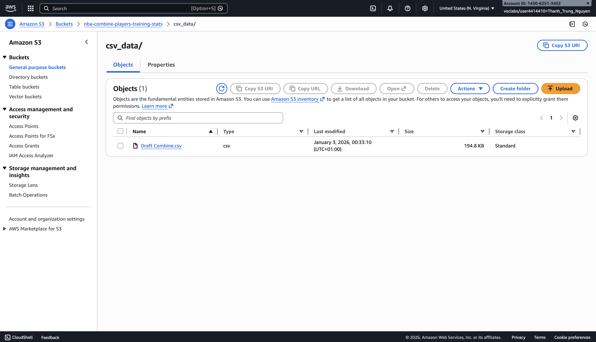

2. **NBA API (Players' performance stats) from BallDontLie website → AWS Lambda + Weekly EventBridge Trigger → Amazon S3 (raw data)**

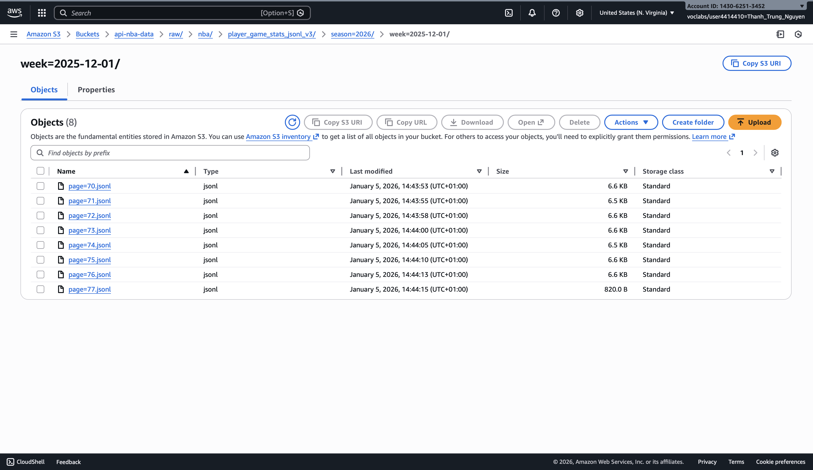

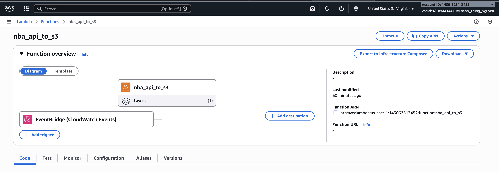

The following AWS Lambda function retrieves NBA player game statistics from an external API,
handles rate limiting and pagination, and stores the data in Amazon S3 using a JSON Lines format.


```python
import os
import json
import requests
import boto3

# --- API setup ---
API_KEY = os.environ["BALLDONTLIE_API_KEY"]
BASE_URL = "https://api.balldontlie.io/v1/stats"
HEADERS = {"Authorization": f"Bearer {API_KEY}"}

# --- S3 setup ---
s3 = boto3.client("s3")
BUCKET = "api-nba-data"
KEY = "demo/nba_player_game_stats.jsonl"


def fetch_stats(start_date, end_date, per_page=25):
    params = {
        "start_date": start_date,
        "end_date": end_date,
        "per_page": per_page
    }
    r = requests.get(BASE_URL, headers=HEADERS, params=params, timeout=30)
    r.raise_for_status()
    return r.json()["data"]


def clean_stats(data):
    cleaned = []
    for s in data:
        player = s.get("player") or {}
        game = s.get("game") or {}

        cleaned.append({
            "game_date": game.get("date"),
            "game_id": game.get("id"),
            "player_id": player.get("id"),
            "player_name": f"{player.get('last_name')}, {player.get('first_name')}",
            "pts": s.get("pts"),
            "reb": s.get("reb"),
            "ast": s.get("ast"),
            "min": s.get("min"),
        })
    return cleaned


if __name__ == "__main__":
    stats = fetch_stats("2025-12-01", "2025-12-07")
    cleaned = clean_stats(stats)

    body = "\n".join(json.dumps(row) for row in cleaned)

    s3.put_object(
        Bucket=BUCKET,
        Key=KEY,
        Body=body
    )

    print(f"Wrote {len(cleaned)} rows to s3://{BUCKET}/{KEY}")
```

3. **AWS Crawler and Glue Database to store CSV and API data and their combination**

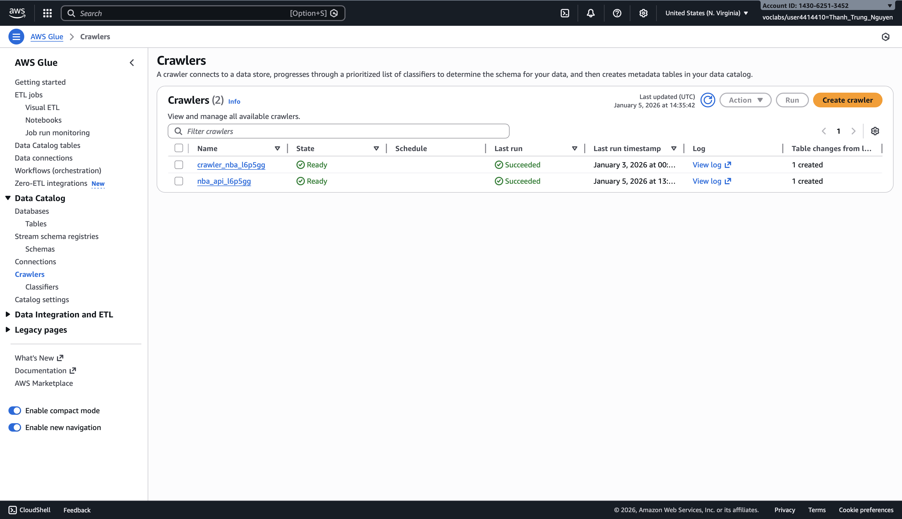
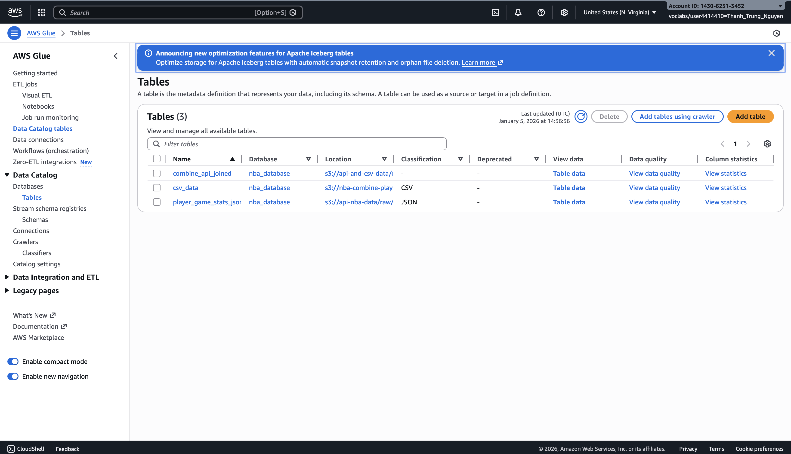

4. **Amazon Athena → SQL analysis**

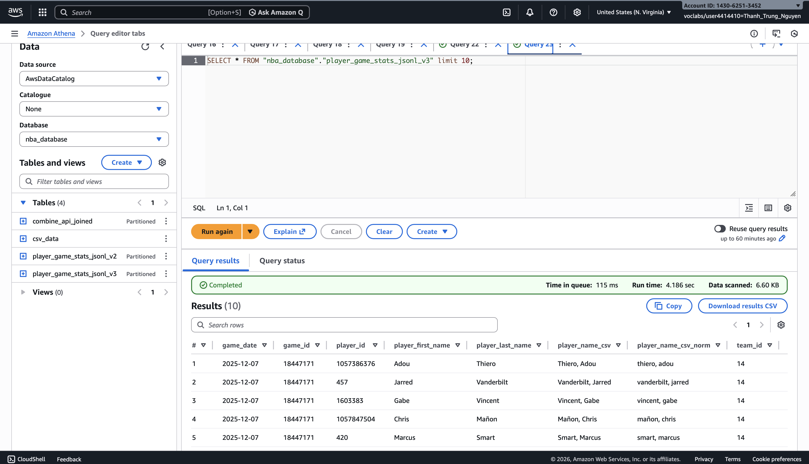
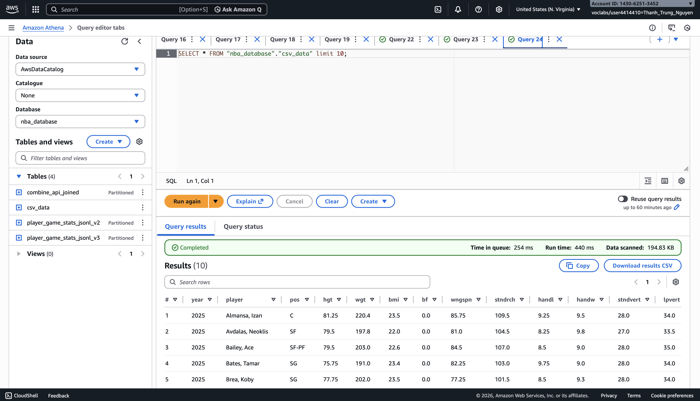
5. **Amazon Athena (CTAS) → Amazon S3 (curated Parquet data) CSV and API data joined**

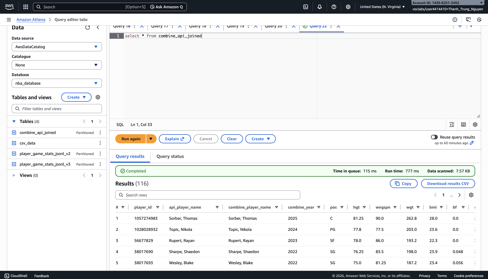

```sql
CREATE TABLE nba_database.combine_api_joined
WITH (
  format = 'PARQUET',
  parquet_compression = 'SNAPPY',
  external_location = 's3://api-and-csv-data/curated/combined/',
  partitioned_by = ARRAY['season']
) AS
SELECT
  CAST(s.player_id AS BIGINT) AS player_id,
  s.player_name_csv AS api_player_name,
  c.player AS combine_player_name,

  c.year AS combine_year,
  c.pos,
  c.hgt,
  c.wngspn,
  c.wgt,
  c.bmi,
  c.bf,

  s.game_date,
  CAST(s.game_id AS BIGINT) AS game_id,
  CAST(s.team_id AS BIGINT) AS team_id,
  CAST(s.pts AS DOUBLE) AS pts,
  CAST(s.reb AS DOUBLE) AS reb,
  CAST(s.ast AS DOUBLE) AS ast,
  s.min,

  s.season
FROM nba_database.player_game_stats_jsonl_v3 s
JOIN nba_database.csv_data c
  ON lower(trim(c.player)) = s.player_name;
```
### Automation
- AWS Lambda retrieves NBA game data from the API
- Lambda supports retries, rate limits, and checkpointing
- Athena CTAS is used to create the final curated dataset

### Cost Considerations

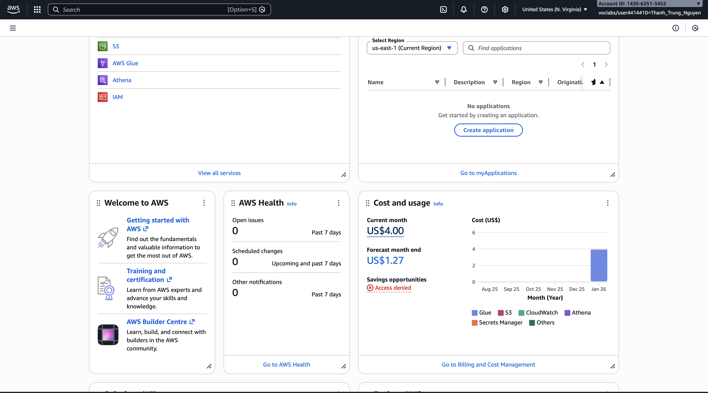
- AWS Lambda: low cost due to short execution time
- Amazon S3: low-cost object storage
- Amazon Athena: pay-per-query analytics
- No always-on servers are required

### Pipeline Visualisation


---

## 4. Data Sources

### 4.1 NBA Draft Combine Data (CSV)

The Draft Combine dataset contains **static, pre-draft player measurements**, including:
- Player name
- Height, weight, and wingspan
- Body fat percentage
- Position and draft year

**Processing steps:**
- CSV uploaded to Amazon S3
- Athena table created over the CSV
- Numeric columns cleaned and typed correctly
- Player name formatting preserved for joining

---

### 4.2 NBA Player Game Statistics (API)

NBA player game data was retrieved from the **balldontlie API**, including:
- Player identifiers and names
- Game-level statistics (points, rebounds, assists, minutes)
- Game and team information

**Processing steps:**
- AWS Lambda retrieves paginated API responses
- Rate limits handled using exponential backoff
- Data written to S3 in **JSON Lines format**
- Player names formatted as `"Last, First"` to match CSV data
- A normalized lowercase name column created for joining

---

## 5. Key Performance Indicators (KPIs)

## KPI 1 (CSV only): Average Physical Profile by Position

```sql
SELECT
  pos,
  COUNT(*) AS players,
  ROUND(AVG(hgt), 1) AS avg_height,
  ROUND(AVG(wgt), 1) AS avg_weight
FROM nba_database.csv_data
WHERE pos IS NOT NULL
GROUP BY pos
ORDER BY avg_height DESC;
```

This query analyzes **draft combine data only** and shows how player size differs by position before entering the NBA.

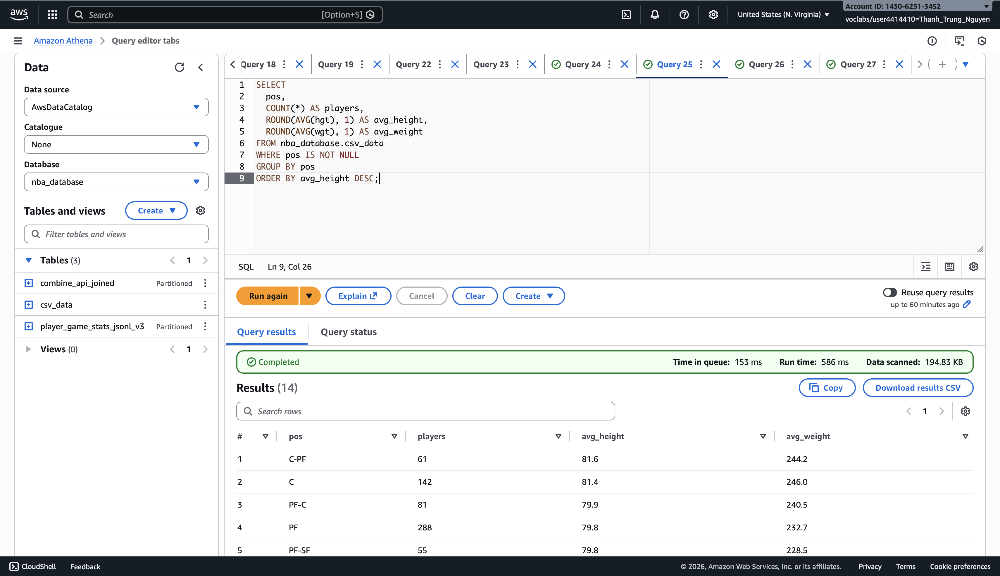


## KPI 2 (API only): Average Game Performance

```sql
SELECT
  ROUND(AVG(pts), 2) AS avg_points,
  ROUND(AVG(reb), 2) AS avg_rebounds,
  ROUND(AVG(ast), 2) AS avg_assists
FROM nba_database.player_game_stats_jsonl_v3
WHERE pts IS NOT NULL;
```

This query summarizes **NBA game performance** using API data and provides a baseline for player productivity.

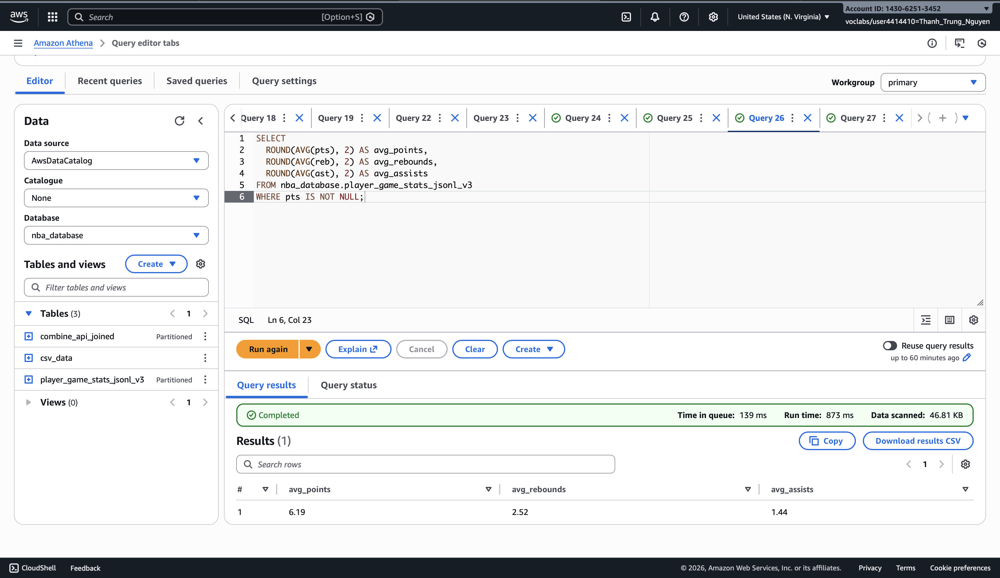

## KPI 3 (Combined CSV + API): Height vs Rebounding Impact

```sql
SELECT
  CASE
    WHEN hgt < 78 THEN 'Short'
    WHEN hgt < 82 THEN 'Medium'
    ELSE 'Tall'
  END AS height_group,
  COUNT(*) AS rows,
  ROUND(AVG(reb), 2) AS avg_rebounds
FROM nba_database.combine_api_joined
WHERE hgt IS NOT NULL
  AND reb IS NOT NULL
GROUP BY
  CASE
    WHEN hgt < 78 THEN 'Short'
    WHEN hgt < 82 THEN 'Medium'
    ELSE 'Tall'
  END
ORDER BY avg_rebounds DESC;
```

This query uses the **combined dataset** to analyze whether taller players tend to collect more rebounds in real NBA games.

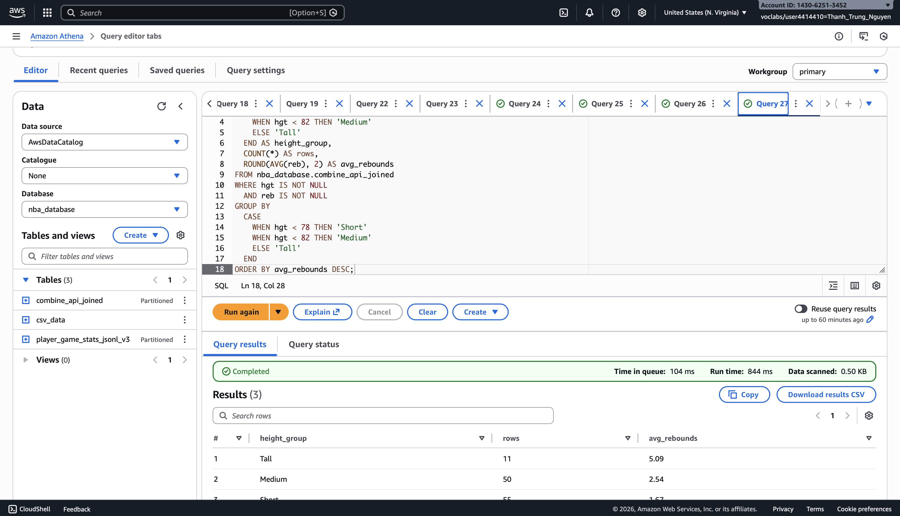

## KPI 4 (CSV only): Draft Combine Participation by Year

```sql
SELECT
  year,
  COUNT(*) AS players
FROM nba_database.csv_data
GROUP BY year
ORDER BY year DESC;
```

This query shows how many players participated in the NBA Draft Combine each year, giving context on the size of each draft class.

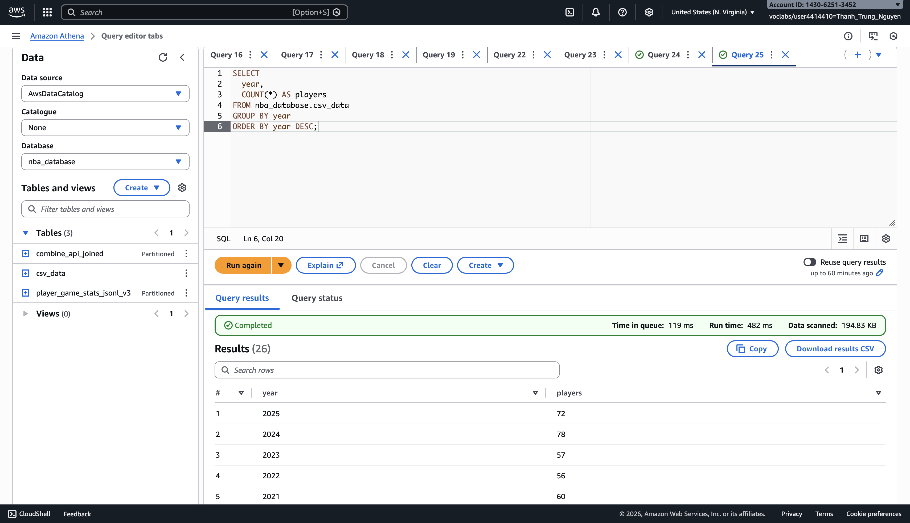

## KPI 5 (API only): Average Minutes Played per Game

```sql
SELECT
  ROUND(AVG(CAST(NULLIF(min, '') AS DOUBLE)), 2) AS avg_minutes
FROM nba_database.player_game_stats_jsonl_v3
WHERE min IS NOT NULL;
```

This query measures the average playing time per player appearance, helping contextualize scoring and rebounding statistics.

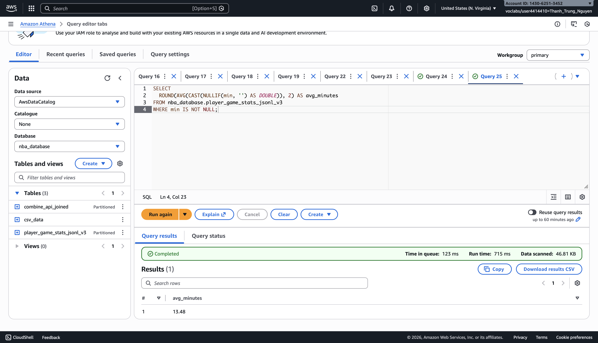

## KPI 6 (Combined CSV + API): Average Points by Position

```sql
SELECT
  pos,
  COUNT(*) AS rows,
  ROUND(AVG(pts), 2) AS avg_points
FROM nba_database.combine_api_joined
WHERE pos IS NOT NULL
  AND pts IS NOT NULL
GROUP BY pos
ORDER BY avg_points DESC;
```

This query combines **draft position data** with **NBA game performance** to analyze how different positions contribute offensively.

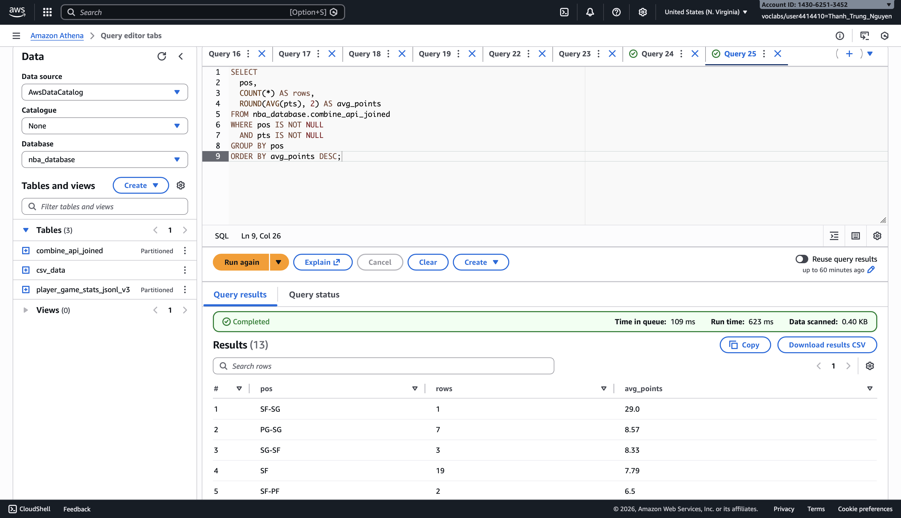

---

## 6. Core Contribution: Combining CSV and API Data

The most important part of this project is the **integration of Draft Combine CSV data with NBA API
game statistics**.

### Challenges
- Different identifiers (names vs numeric IDs)
- Inconsistent naming conventions
- Schema conflicts caused by partition columns

### Solution
- A normalized lowercase join key was created to handle formatting differences
- Amazon Athena CTAS was used to:
  - Join the CSV and API datasets
  - Select relevant physical and performance attributes
  - Write the result as **Parquet files** to a new S3 bucket
  - Register the final table automatically in Athena

This step produced a **single, unified dataset** that links physical attributes with actual
NBA performance.

---

## 7. Limitations and Future Work

### Limitations
- Name-based joins may miss players with inconsistent naming
- Draft Combine data is static and limited to pre-draft measurements
- Analysis is exploratory rather than predictive

### Future Improvements
- Add a dedicated player dimension table
- Extend API ingestion to cover multiple seasons
- Introduce advanced efficiency metrics
- Visualize results using a BI tool

---

## 8. Conclusion

This project demonstrates how structured CSV data and external API data can be integrated into
a single analytics pipeline using AWS services.

By combining Draft Combine measurements with NBA game statistics, the pipeline enables
performance analysis that would not be possible using either dataset alone.
